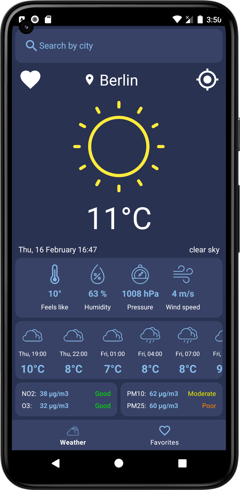
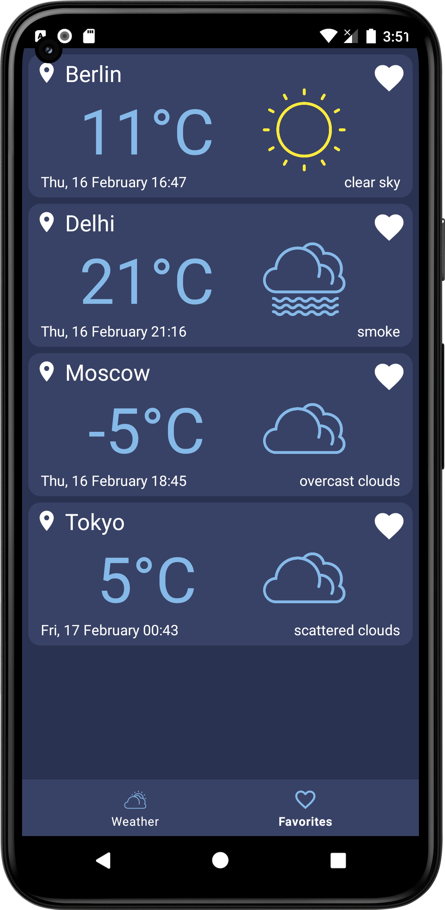

# Weather-api

Weather-api is a simple weather and air pollution forecast application that uses some APIs to get 3 day / 3 hour forecast data from [OpenWeatherMap](https://openweathermap.org/api).

### Architecture

* MVVM
* [Kotlin](https://kotlinlang.org/) 100%
* [Coroutines](https://github.com/Kotlin/kotlinx.coroutines)
* [Flow](https://kotlinlang.org/docs/flow.html)

### Preview

/>

### Libraries and tools 🛠

* Navigation component
* ViewModel
* LiveData
* RoomDB
* Hilt
* Retrofit
* OkHttp
* Moshi
* ViewBindingPropertyDelegate
* AndroidVeil
